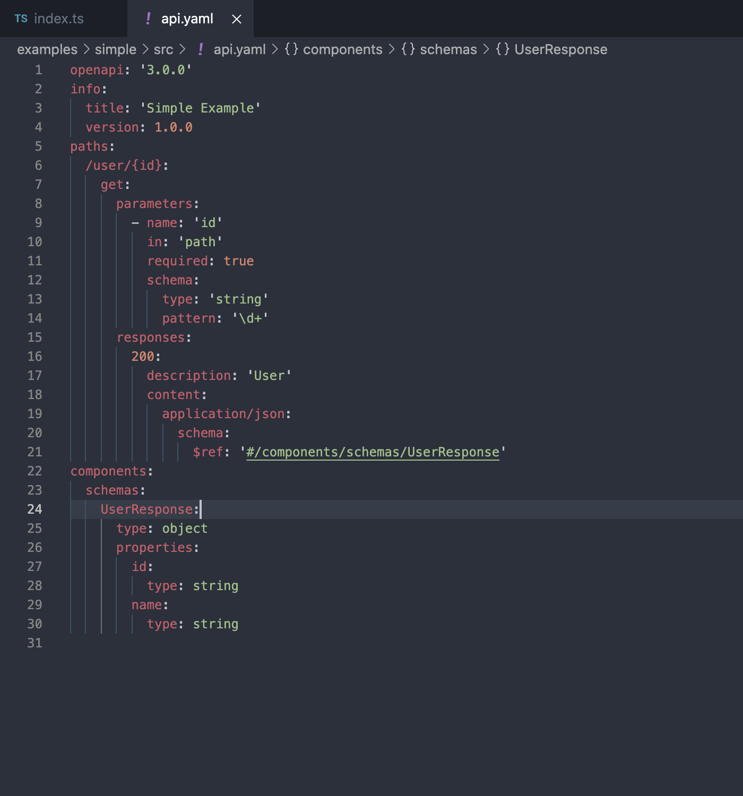

[](https://circleci.com/gh/ovotech/laminar)

# Laminar

A library for building node services in TypeScript. Convert external interfaces into TypeScript types with a cli tool - so that http request / responses would be validated against the OpenApi schema **at compile time**. Supports kafka / schema registry too, for event driven requests.

This is an attempt to implement the concepts of [Design-First, Evolve with Code](https://apisyouwonthate.com/blog/api-design-first-vs-code-first) principles cleanly.

| OpenAPI Definition                        | Service Implementation                    |
| ----------------------------------------- | ----------------------------------------- |
|  |  |

For detailed documentation, refer to https://ovotech.github.io/laminar/#/

## Why?

It works mostly as [express](https://expressjs.com) or [koa](https://koajs.com) but does not use any mutation on any of its requests objects, guaranteing runtime safety. Since all your request handlers and middlewares will be statically typed, if it compiles it will probably run.

Also, all of the external dependancies are created and instantiated by the user. E.g. postgres pools and the like are created by you, and you pass them down to laminar, so it can handle its lifecycle. This allows you to be flexible about where and how you use it.

And lastly there is no external code dependancies, as we only depend on mimetype databases and official openapi definitions.

## Effortless scaling


Laminar is designed around _Service_ objects that handle different requests - coming from http, kafka, queue managers etc. Each of those _Services_ is able to spawn multiple concurrent workers, that process the requests.

You can easily scale your laminar app by increasing the workers for each _Service_, or increse the instances of your whole node application (thus scaling each _Service_ within the application). If any particular _Service_ demands more resource you can move it to its own Laminar application and scale that separately. Since each worker would be a pure stateless function, moving them around to differnet packages should be simple enough.


This flexibility allows you to keep all your code in one codebase, but quickly spin it off if size / scale demands it.

A typical laminar app will concist of setting up the various instances that you depend on, like db connections, queues etc. and defining all your business logic in pure functions that contain your business logic. Laminar then works like glue that would hold them together, allowing you full control of each end.

## Middlewares and external Dependencies


A key concept in Laminar is the use of middlewares, those are async function wrappers, that can be used to inject dependencies into function calls, while themselves being just functions. Very similar to [express middlewares](https://expressjs.com/en/guide/using-middleware.html), but allowing you to statically define and enforce the types all around.

In practice it ends up looking like dependency injection, but it's just function calls and without the magic. As fancy as that may sound, a middleware is just a function wrapper. An example postgres middleware that take a pool and for each incomming request (function execution) will get a connection to the pool, pass it down to the function, and cleanup after its done.

> [examples/docs/src/middleware.ts:(middleware)](https://github.com/ovotech/laminar/tree/main/examples/docs/src/middleware.ts#L4-L23)

```typescript
import { Middleware } from '@ovotech/laminar';
import { Pool, PoolClient } from 'pg';

interface DBContext {
  db: PoolClient;
}

const pgPoolMiddleware = (pool: Pool): Middleware<DBContext> => {
  return (next) => async (ctx) => {
    const db = await pool.connect();
    try {
      return await next({ ...ctx, db });
    } finally {
      db.release();
    }
  };
};
```

## Installation

You'll need to install `@ovotech/laminar` package:

```shell
yarn add @ovotech/laminar
```

Additionally, if you want to take advantage of the type generation:

```shell
yarn add --dev @ovotech/laminar-cli
```

## A tutorial to get started.

For a single http service, you'll need a very simple OpenAPI schema file, something like:

> [examples/simple/src/api.yaml](https://github.com/ovotech/laminar/tree/main/examples/simple/src/api.yaml)

```yaml
openapi: '3.0.0'
info:
  title: 'Simple Example'
  version: 1.0.0
paths:
  /user/{id}:
    get:
      parameters:
        - name: 'id'
          in: 'path'
          required: true
          schema:
            type: 'string'
            pattern: '\d+'
      responses:
        200:
          description: 'User'
          content:
            application/json:
              schema:
                $ref: '#/components/schemas/UserResponse'
components:
  schemas:
    UserResponse:
      type: object
      properties:
        id:
          type: string
        name:
          type: string
```

First we'll generate the types for its so its easier to implement it. Since we've already installed `@ovotech/laminar-cli` we can:

```shell
yarn laminar api --file api.yaml --output __generated__/api.ts
```

> [examples/simple/src/index.ts](https://github.com/ovotech/laminar/tree/main/examples/simple/src/index.ts)

```typescript
import { HttpService, init, jsonOk } from '@ovotech/laminar';
import { join } from 'path';
import { openApiTyped } from './__generated__/api';

/**
 * A simple function to get some data out of a data store, think databases and the like.
 * Though for bravity it just returns a static js object.
 */
const findUser = (id: string) => ({ id, name: 'John' });

const main = async () => {
  /**
   * Since we've already generated this using the api file, the paths,
   * all of its request and response data would be properly typed
   */
  const listener = await openApiTyped({
    api: join(__dirname, 'api.yaml'),
    paths: {
      '/user/{id}': {
        get: async ({ path }) => {
          /**
           * Our types would require us to return a 200 json response specifically,
           * otherwise it would not compile. That's what `jsonOk` function does.
           */
          return jsonOk(findUser(path.id));
        },
      },
    },
  });

  /**
   * Now we need to create the Http Service that would call our listener.
   * Its a very shallow wrapper around `http.createService` from node
   * Default port is 3300
   */
  const http = new HttpService({ listener });

  /**
   * We can now start it by calling `init`.
   * Output would then be sent to the logger we've specified: node's console.
   */
  await init({ initOrder: [http], logger: console });
};

main();
```

## API

Api for laminar and supporting packages: https://ovotech.github.io/laminar/api

## Functioning examples

You can dive in directly with some example apps:

- [examples/simple](https://github.com/ovotech/laminar/tree/main/examples/simple) Where you see how the most minimal laminar app with generated types can look like
- [examples/security](https://github.com/ovotech/laminar/tree/main/examples/security) With some simple security built in
- [examples/petstore](https://github.com/ovotech/laminar/tree/main/examples/petstore) A minimal but functional petstore implementation - with working jwt security and database access
- [examples/comms](https://github.com/ovotech/laminar/tree/main/examples/comms) An api that holds some state for an external email api.
- [examples/data-loader](https://github.com/ovotech/laminar/tree/main/examples/data-loader) This is a complex example, showing the use of various laminar services (kafka, database, queue).

## Packages in this monorepo

Laminar includes packages that are used internally or are additions to its core features.

- [@ovotech/laminar](https://github.com/ovotech/laminar/main/tree/packages/laminar) - [OpenAPI](https://swagger.io/docs/) the core laminar package
- [@ovotech/laminar-cli](https://github.com/ovotech/laminar/main/tree/packages/laminar-cli) - [OpenAPI](https://swagger.io/docs/) type generation for OpenAPI, json-schema, Avro and axios
- [@ovotech/laminar-handlebars](https://github.com/ovotech/laminar/main/tree/packages/laminar-handlebars) - [handlebars](https://github.com/wycats/handlebars.js/) middleware
- [@ovotech/laminar-jwt](https://github.com/ovotech/laminar/main/tree/packages/laminar-handlebars) - [JSON Web Token](https://github.com/auth0/node-jsonwebtoken) middleware
- [@ovotech/json-schema](https://github.com/ovotech/laminar/main/tree/packages/json-schema) - Lightweight json-schema validator
- [@ovotech/laminar-pg](https://github.com/ovotech/laminar/main/tree/packages/laminar-pg) - Connect to postgres db
- [@ovotech/laminar-winston](https://github.com/ovotech/laminar/tree/main/packages/laminar-winston) - Use winston logger
- [@ovotech/laminar-kafkajs](https://github.com/ovotech/laminar/tree/main/packages/laminar-kafkajs) - Use kafkajs to consumer and produce kafka messages, with schema registry support
- [@ovotech/laminar-pgboss](https://github.com/ovotech/laminar/tree/main/packages/laminar-pgboss) - Use pgboss to schedule jobs
- [@ovotech/laminar-fixtures](https://github.com/ovotech/laminar/tree/main/packages/laminar-fixtures) - Fixtures for pg with relationships

## Running the tests

You'll need to start a postgres instance to run the tests for some of the exmaples

```shell
docker-compose up
```

You can then run the tests with:

```shell
yarn test
```

### Coding style (linting, etc) tests

Style is maintained with prettier and eslint

```
yarn lint
```

## Deployment

Deployment is done by yarn automatically on merge / push to main, but you'll need to bump the package version numbers yourself. Only updated packages with newer versions will be pushed to the npm registry.

## Contributing

Have a bug? File an issue with a simple example that reproduces this so we can take a look & confirm.

Want to make a change? Submit a PR, explain why it's useful, and make sure you've updated the docs (this file) and the tests (see [test folder](test)).

## License

This project is licensed under Apache 2 - see the [LICENSE](LICENSE) file for details
